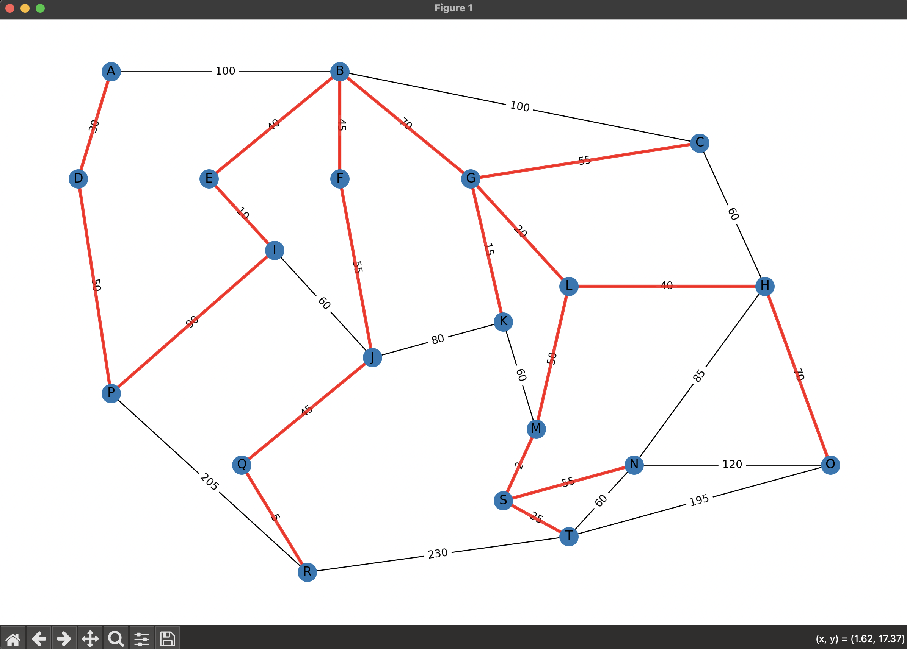

# Prim's Algorithm Visualizer

This project demonstrates Prim's algorithm for finding the Minimum Spanning Tree (MST) of a weighted undirected graph. The implementation includes step-by-step visualization using `networkx` and `matplotlib`, highlighting edges as they are added to the MST.

  

## Features
- **Automatic Start Node**: The algorithm starts from the node connected to the edge with the smallest weight in the graph.
- **Step-by-Step Visualization**: Watch the MST being built edge by edge, with selected edges highlighted in red.
- **Graph Visualization**: Nodes are positioned to approximate a map-like layout for intuitive viewing.
- **MST Output**: The final MST edges and their weights are printed in the console.

## Prerequisites
- Python 3.x
- Libraries: `heapq`, `networkx`, `matplotlib`

Install dependencies using:
```bash
pip install networkx matplotlib
```

## Usage
1. Clone the repository or download `main.py`.
2. Run the script:
   ```bash
   python main.py
   ```
3. Observe the console for the MST result and the matplotlib window for the visualization.

### Graph Structure
The predefined graph includes nodes labeled `A` to `T` with manually assigned coordinates to mimic a map. Edge weights are defined in the `graph` dictionary within `main.py`. Example edges:
```python
'A': [('B', 100), ('D', 85)],
'B': [('A', 100), ('C', 100), ('E', 40), ...],
...
```

## Output
- **Console**: Prints the MST edges and their weights:
  ```
  Árbol de Expansión Mínima:
  D -- P (peso: 10)
  P -- R (peso: 5)
  ...
  ```
- **Visualization**: A window displays the graph with edges turning red as they join the MST. The final MST is shown with thicker red lines.

## Customization
Modify the `graph` dictionary in `main.py` to test different graphs. Adjust the `pos` dictionary to change node positions in the visualization.

